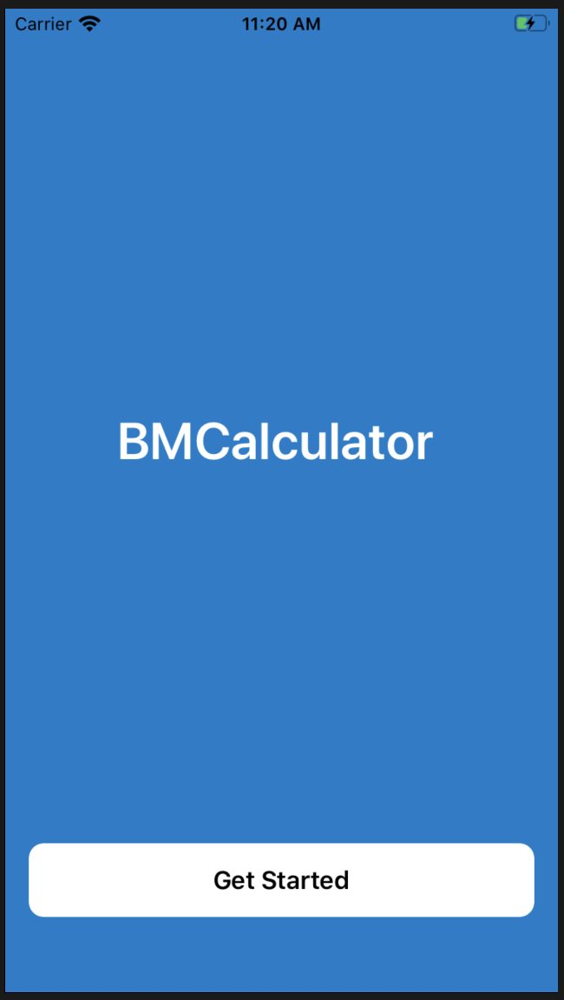
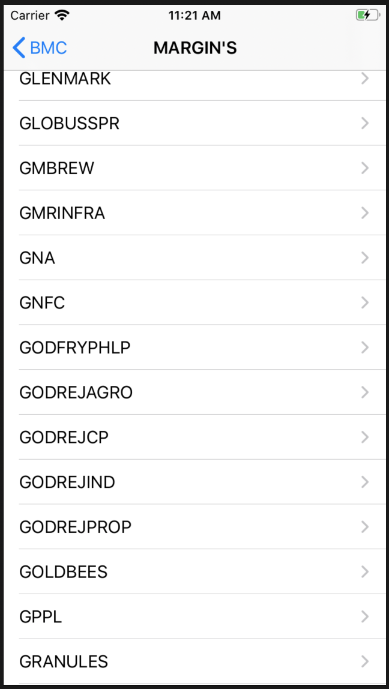
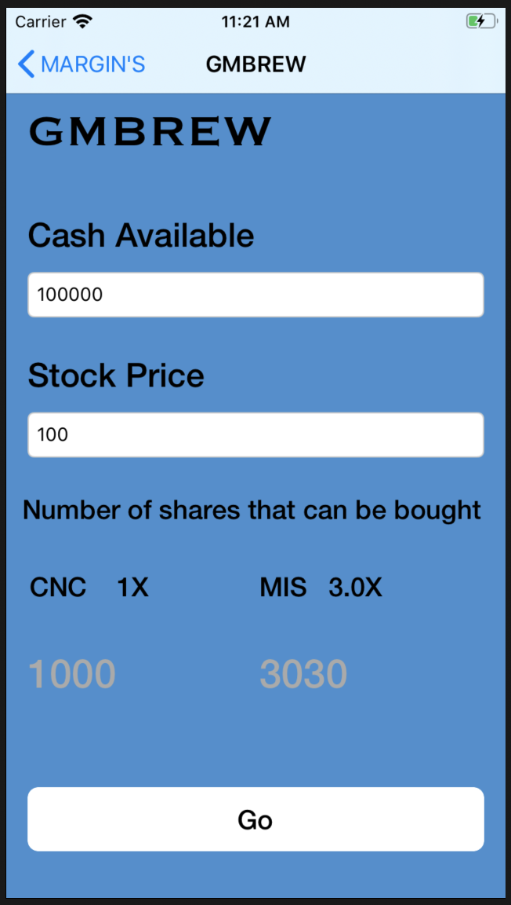

# BMCalculator
An iOS application that Helps in Calculating Brokerage and Margin for the stock quotes 

# App Description
The BMCalculator application allows users that to get all the Stock quotes tha provides information about the leverages and company information, margins etc.

# Snapshots of Screen Boards
 

# Working 
open project and traverse to the corresponding directory and install all the pods from the pod file workspace is created, then run the project 
